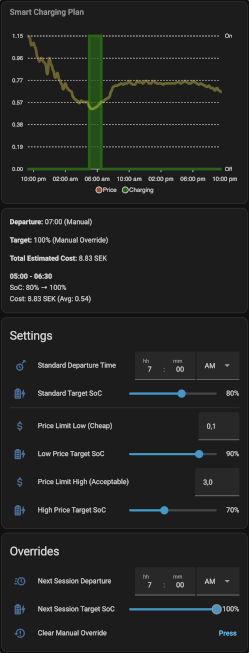
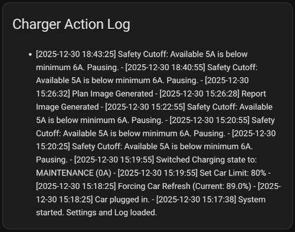
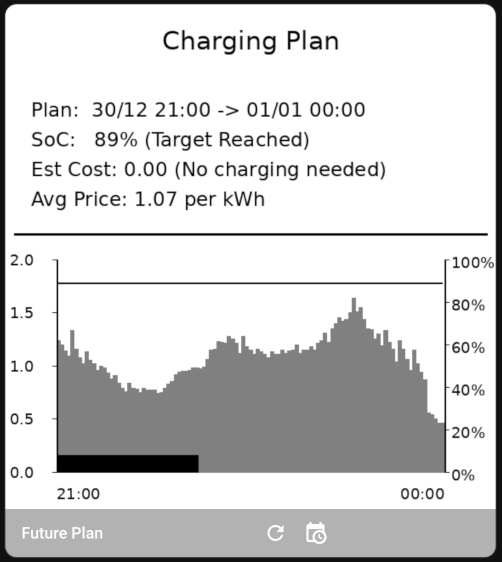
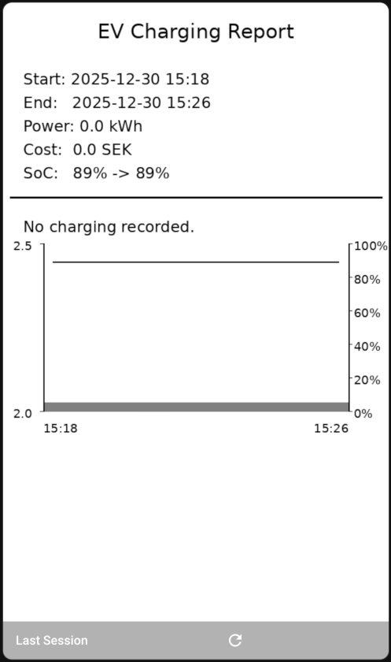

# Dashboard cards

## Sample card with typical information

A graph showing planned charging time, followed by a summary of it in text. Then follows some standard settings as well as "one-time" overrides.

[YAML code](./lovelace_example.yaml)

## Interactive charging graph

Only the graph, showing the planned charging time. Interactive version that allows showing a bit more info on hovering.

[YAML code](./lovelace_example_graph.yaml)

## Summary of planned charging (text)

Only the summary text of the planned charging.

[YAML code](./lovelace_example_summary.yaml)

## Settings

The settings, default and overrides.

[YAML code](./lovelace_example_settings_and_overrides.yaml)

## Action Log

The log of what actions was taken. This shows an extensive log including timestamps of when charging started/stopped, what amps were set for the charger, car being plugged in or unplugged, and more.

[YAML code](./lovelace_example_action_log.yaml)

## Charging Plan

An image showing the current charging plan for the entire window it knows the electricity price, with a button to re-generate it. Shows a line for expected car charge level at each time, the price bars for each time interval and black bars for when the charger will be on (charging and maintenance mode). Image can be downloaded to eg. be printed on a thermal printer. (Can be used as a more lightweight graph than the ApexChart version above)

[YAML code](./lovelace_example_charging_plan.yaml)

## Charging Report

An image showing the last carried out charging session, with a button to generate it instantly, instead of when car is unplugged. Shows a line for the cars charge level (estimated and/or real value), price bars for the electricity price and black bars for when the charger was actively charging. Image can be downloaded to eg. be printed on a thermal printer.

(Sorry, but sample image only shows a short snapshot without any recorded charging data, but also shows that it handles when no charging was carried out.)

[YAML code](./lovelace_example_charging_report.yaml)
